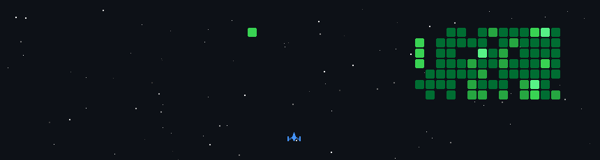

## <h2> नमस्ते (Namaste)🙏🏻, I'm Aman Kashyap!</h2>

<em>Software Engineer @ MAQ Software | Azure Data Engineer | IIIT Bhagalpur Grad '24 
</em>

---

### 🧑‍💻 About Me:
- 📊 **Data Engineer** passionate about building scalable data pipelines
- ☁️ Working with **Azure**, **Databricks**, and **Delta Lake** daily
- 🏗️ Architecting **Medallion Architecture** for enterprise clients
- 📈 Turning **2.4B+ raw records** into actionable insights
- 🎯 Currently focused on **Cloud Data Engineering & Analytics**

 

### 🌐 Find me all around the web:

---

### 🛠️ Data Engineering Toolkit:

#### 📊 Languages & Query

#### ☁️ Cloud & Data Platforms

#### ⚙️ Tools & Technologies

#### 🏗️ Architecture & Practices

---

### 💼 Professional Experience

<table>
<tr>
<td width="80" align="center"></td>
<td>

**Software Engineer** _(May 2024 - Present)_
- 🔧 Designed Azure DevOps **CI/CD pipelines**, reducing delivery time by **20%**
- ⚡ Optimized **60+ Databricks notebooks** (PySpark/SQL) and automated **30+ ADF pipelines**
- 🏗️ Engineered **Medallion Architecture** processing **2.4B+ records** with **0% data discrepancies**
- 📊 Built Gold & Silver **Delta Lake tables** powering Power BI analytics

</td>
</tr>
<tr>
<td width="80" align="center"></td>
<td>

**Backend Developer Intern** _(Jan 2024 - April 2024)_
- 🕷️ Developed **Python web crawlers** for automated data extraction
- 🗄️ Reduced database **migration time by 40%** using SQLAlchemy
- 🔐 Built and optimized **RESTful APIs** for high-integrity data delivery

</td>
</tr>
</table>

  

  

---

### 🏆 Certifications & Achievements

| Badge | Certification | Status |
|:---:|:---|:---:|
|  | **Azure Data Engineer Associate** | ✅ Certified |
|  | **Azure Data Scientist Associate** | ✅ Certified |
|  | **Snowflake SnowPro Core** | ✅ Certified |
|  | **SPOT Awards 2024 & 2025** | 🌟 Awarded |

---

### 🎮 GitHub Space Shooter:

> 🚀 My contribution graph transformed into an epic space shooter! Updates automatically every day.

---

### 📊 GitHub & LeetCode Stats:

  <table>
    <tr>
      <td width="50%" valign="top">
        
      </td>
      <td width="50%" valign="top">
        
      </td>
    </tr>
  </table>

---

### 📫 Let's Connect:

💡 *"There are two ways to write error-free programs; only the third one works"*

**Open to collaborations on Data Engineering, Azure, and Cloud projects!**

